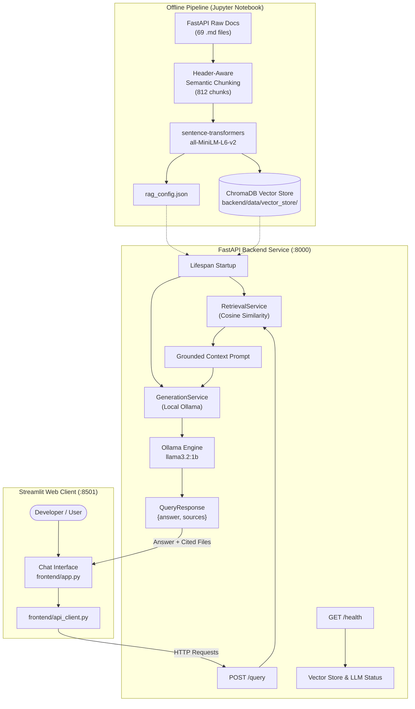
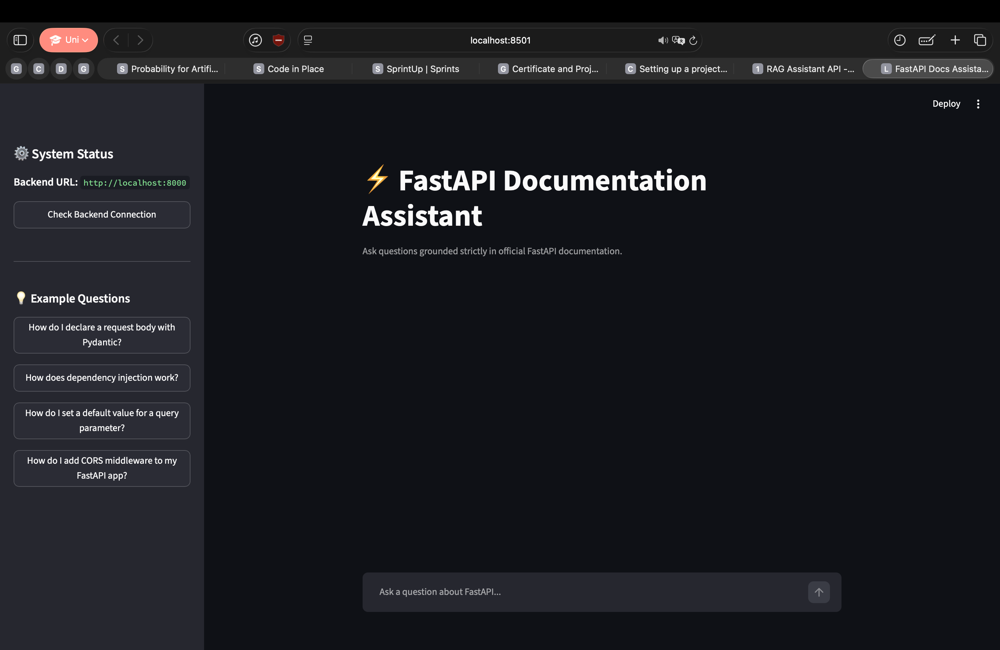
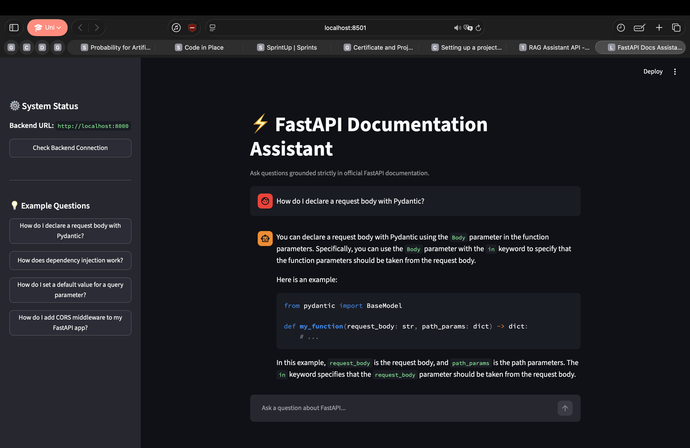
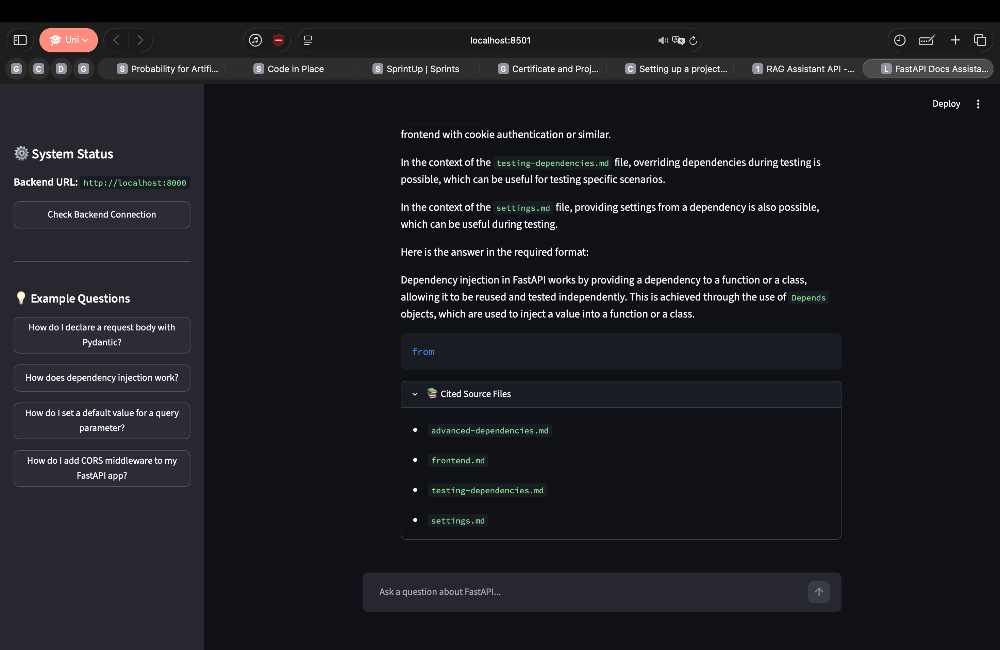

# ⚡ FastAPI Documentation RAG Assistant

An end-to-end, local Retrieval-Augmented Generation (RAG) assistant specifically built and optimized for the **FastAPI framework documentation** (Tutorial and Advanced sections). The system indexes markdown documentation files into a vector store using semantic embeddings and generates cited answers using local LLM inference via Ollama.

---

## 🏛️ Architecture Overview

The system consists of an offline indexing and evaluation pipeline in Jupyter, a high-performance **FastAPI** backend service utilizing **ChromaDB**, and an interactive **Streamlit** chat interface.



---

## 💻 Tech Stack

- **Large Language Model**: [Ollama](https://ollama.com/) running `llama3.2:1b` locally.
- **Embedding Model**: `sentence-transformers/all-MiniLM-L6-v2` (384-dimensional dense vectors).
- **Vector Database**: [ChromaDB](https://www.trychroma.com/) (`PersistentClient` with cosine similarity index).
- **Backend**: [FastAPI](https://fastapi.tiangolo.com/), [Uvicorn](https://www.uvicorn.org/), [Pydantic v2](https://docs.pydantic.dev/), `pydantic-settings`.
- **Frontend**: [Streamlit](https://streamlit.io/) with custom interactive chat components.
- **Testing**: [pytest](https://docs.pytest.org/), `fastapi.testclient.TestClient`.
- **Data Engineering**: Header-aware semantic chunking with fallback overlap via custom parser.

---

## 📂 Project Structure

```text
rag-assistant-project/
├── .gitignore
├── README.md
├── requirements.txt
├── notebooks/
│   └── rag_pipeline.ipynb              # Phase 2 notebook (Sections 2.1 – 2.7)
├── data/
│   ├── raw/                            # 69 FastAPI documentation files + edge cases (.gitignore)
│   └── vector_store/                   # Persistent vector store generated in notebook
├── backend/
│   ├── Dockerfile                      # Container definition
│   ├── requirements.txt                # Pinned backend dependencies
│   ├── .env.example                    # Backend environment template
│   ├── app/
│   │   ├── main.py                     # FastAPI application factory & lifespan
│   │   ├── api/
│   │   │   └── routes/
│   │   │       └── query.py            # POST /query and GET /health
│   │   ├── core/
│   │   │   └── config.py               # Reads backend/data/vector_store/rag_config.json
│   │   ├── schemas/
│   │   │   └── query.py                # QueryRequest & QueryResponse Pydantic models
│   │   ├── services/
│   │   │   ├── retrieval.py            # ChromaDB retrieval & manual query embedding
│   │   │   └── generation.py           # Grounded prompt building & Ollama interface
│   │   └── utils/
│   │       └── logging_config.py       # Centralized logger
│   ├── data/
│   │   └── vector_store/               # Exported Chroma store & rag_config.json
│   └── tests/
│       └── test_query.py               # Happy-path and 422 validation tests
└── frontend/
    ├── requirements.txt                # Pinned frontend dependencies
    ├── .env                            # Frontend environment configuration
    ├── api_client.py                   # Backend client with error handling & health check
    └── app.py                          # Streamlit chat interface with expandable citations
```

---

## 📖 Domain & Corpus Details

The knowledge base is built from the official **FastAPI** documentation (`tutorial/` and `advanced/` guides):

- **Files in Corpus**: 69 valid markdown documents (plus edge-case files for validation: empty stubs and corrupted binaries).
- **Corpus Statistics**: ~381,127 characters, ~54,080 words (~127 equivalent book pages).
- **Chunking Strategy**: Header-aware semantic chunking based on Markdown headers (`#`, `##`, `###`), preserving code block integrity with fallback fixed-window chunking (`max_chunk_size=800`, `chunk_overlap=150`).
- **Total Chunks**: **812 chunks** indexed and stored in ChromaDB.

### Obtaining the Raw Data
The `data/raw/` folder is excluded from version control. You can obtain or reconstruct it by cloning the official FastAPI documentation repository:
```bash
# Clone the FastAPI repository shallowly
git clone --depth 1 https://github.com/fastapi/fastapi.git /tmp/fastapi

# Copy tutorial and advanced docs into data/raw/
mkdir -p data/raw
cp -r /tmp/fastapi/docs/en/docs/tutorial/* data/raw/
cp -r /tmp/fastapi/docs/en/docs/advanced/* data/raw/
rm -rf /tmp/fastapi
```

---

## ⚙️ Setup & Installation

### 1. Prerequisites
- Python 3.11+
- [Ollama](https://ollama.com/) installed and running:
  ```bash
  ollama run llama3.2:1b
  ```

### 2. Virtual Environment Setup
```bash
python3 -m venv .venv
source .venv/bin/activate
pip install -r backend/requirements.txt
pip install -r frontend/requirements.txt
```

### 3. Running the Backend
From the project root:
```bash
cd backend
uvicorn app.main:app --reload --port 8000
```
- API Documentation (Swagger UI): [http://localhost:8000/docs](http://localhost:8000/docs)
- Health Status: [http://localhost:8000/health](http://localhost:8000/health)

### 4. Running the Frontend
In a separate terminal window:
```bash
cd frontend
streamlit run app.py --server.port 8501
```
- Open [http://localhost:8501](http://localhost:8501) in your browser.

---

## 🔑 Environment Variables

| Variable | Location | Default | Description |
|---|---|---|---|
| `API_BASE_URL` | `frontend/.env` | `http://localhost:8000` | Backend API base URL consumed by `api_client.py`. |
| `OLLAMA_BASE_URL` | `backend/.env` | `http://localhost:11434` | Ollama service endpoint. |
| `LOG_LEVEL` | `backend/.env` | `INFO` | Application log level (`DEBUG`, `INFO`, `WARN`, `ERROR`). |
| `APP_PORT` | `backend/.env` | `8000` | Uvicorn listen port. |

> **Note**: Pipeline parameters (`embedding_model`, `collection_name`, `chunk_size`, `chunk_overlap`, `top_k`, `llm_model`, `vector_store_path`) are loaded automatically at startup from `backend/data/vector_store/rag_config.json`.

---

## 📡 API Reference & Curl Example

### `POST /query`
Performs semantic vector search and generates a grounded response.

**Request:**
```bash
curl -X POST http://127.0.0.1:8000/query   -H "Content-Type: application/json"   -d '{"question": "How do I declare a request body with Pydantic?"}'
```

**Response (`200 OK`):**
```json
{
  "answer": "You can declare a request body with Pydantic by using the `Body` parameter in your function parameters. For example:
```python
from pydantic import BaseModel

class Item(BaseModel):
    name: str
    price: float

@app.post('/items/')
async def create_item(item: Item):
    return item
```",
  "sources": [
    "body.md",
    "body-fields.md",
    "path-operation-advanced-configuration.md"
  ]
}
```

### `GET /health`
Returns backend service, vector store chunk count, and model status.

```bash
curl http://127.0.0.1:8000/health
```

---

## 🧪 Testing

Run the test suite with pytest from the `backend/` directory:
```bash
cd backend
pytest tests/test_query.py -v
```
Tests include:
- `test_query_happy_path`: Validates `200 OK`, non-empty `answer`, and non-empty `sources`.
- `test_query_invalid_input`: Validates `422 Unprocessable Entity` when required `question` parameter is omitted.

---

## 📊 Evaluation & Failure Case Analysis (Section 2.6)

An evaluation of 12 representative FastAPI questions was conducted using `llama3.2:1b` with `top_k=5` cosine retrieval from the persisted Chroma store:

| Verdict | Count | Percentage | Observations |
|---|---|---|---|
| **✅ Correct** | **1** | 8.3% | Basic query parameter defaults. |
| **⚠️ Partial** | **4** | 33.3% | Core concepts mentioned, but subtle syntax constraints missed. |
| **❌ Incorrect** | **7** | 58.3% | Fabricated non-existent APIs and syntax errors. |

### Documented Hallucination Patterns
In 6 of the 12 evaluation answers, `llama3.2:1b` fabricated APIs that do not exist in FastAPI:
- **`@jwt_required()`**: Fabricated decorator claimed to be from `fastapi.security` (Q8).
- **`include_router` keyword argument**: Invented keyword parameter passed into `router.get("/", include_router=...)` (Q11).
- **`CORSMiddleware(...)`**: Called directly as a standalone function without `app.add_middleware(...)` (Q10).
- **`@app_path_operation`**: Fabricated alternative route decorator (Q4).
- **`in_memory=True` flag**: Invented flag on `UploadFile` (Q7).
- **`Body(in=...)`**: Invented parameter syntax on `Body` (Q1).

### Recommended Mitigations
1. **Model Upgrade**: Upgrade from `llama3.2:1b` to `llama3.2` (3B) or `llama3.1:8b` for significantly better adherence to provided context.
2. **Deterministic Sampling**: Set `temperature=0.0` or `0.05` to curb speculative token hallucination.
3. **AST Symbol Verifier**: Integrate a post-generation checker that parses Python code blocks and flags any imported symbols not present in retrieved context.
4. **Enhanced Retrieval Context**: Expand `top_k` (from 5 to 8) and add a cross-encoder reranker for multi-document concepts like OAuth2 and Starlette middleware.

---

## 📸 Screenshots & Demonstrations
## 1. Interactive Streamlit Chat Interface


## 2. FastAPI Swagger UI Documentation (/docs)


## 3. Pipeline Evaluation & Vector Store Execution (Notebook)

